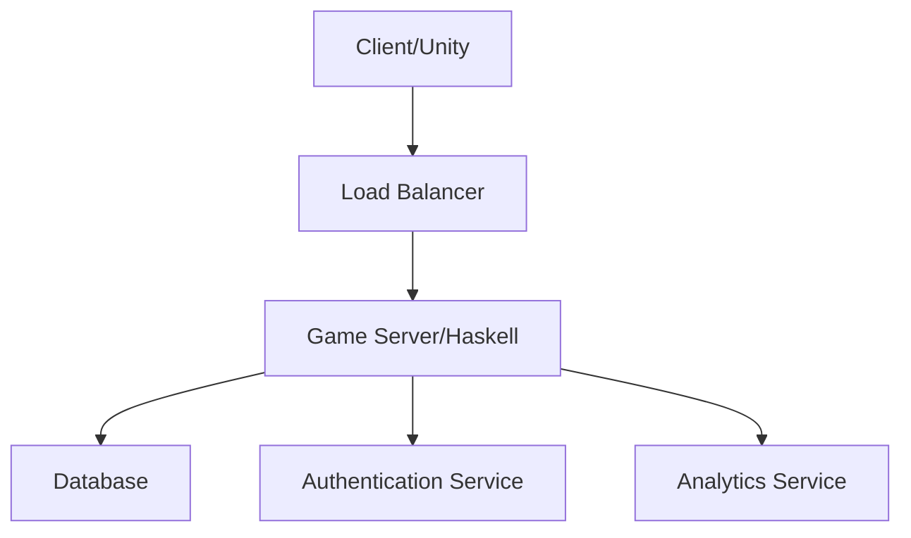
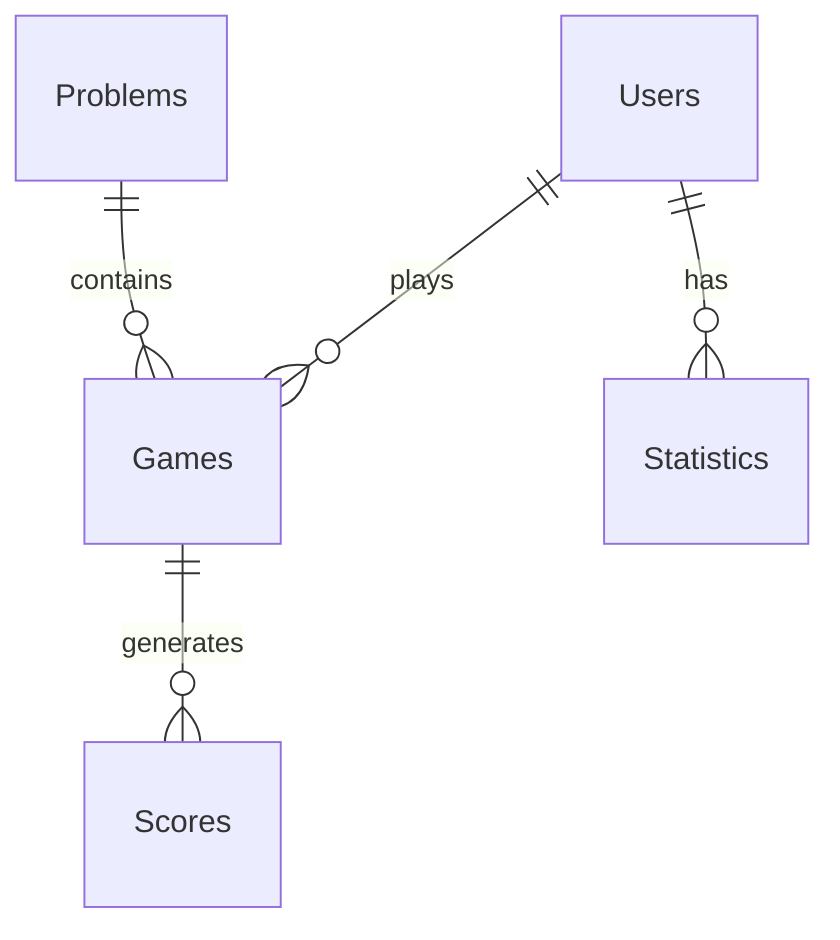
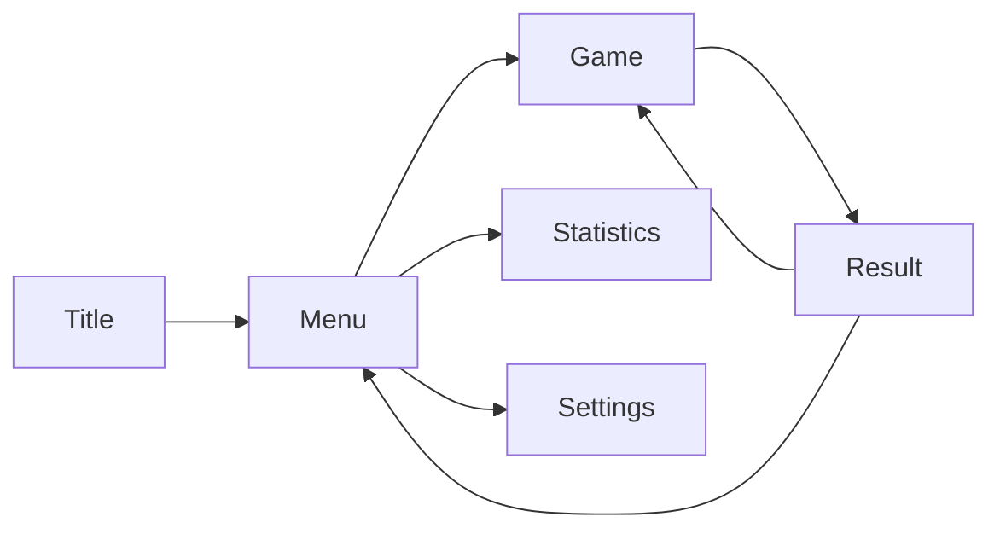
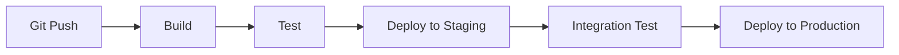

# テキサスホールデム・ショーダウンマスターの詳細設計

## システムアーキテクチャ

### クライアントサーバーモデル

#### クライアント側（Unity）
- ゲームUI表示
- ユーザー入力処理
- ローカルデータキャッシュ

#### サーバー側（GCP）
- ゲームロジック（Haskell）
- ユーザーデータ管理
- スコア管理

### アーキテクチャ図



## データベース設計

### エンティティ関係
- Users (ユーザー情報)
- Games (ゲームセッション)
- Scores (スコア記録)
- Problems (問題セット)
- Statistics (統計データ)

### ER図



### 主要テーブル定義

```sql
CREATE TABLE Users (
    user_id UUID PRIMARY KEY,
    username VARCHAR(50) UNIQUE,
    email VARCHAR(100),
    created_at TIMESTAMP,
    last_login TIMESTAMP
);

CREATE TABLE Games (
    game_id UUID PRIMARY KEY,
    user_id UUID,
    start_time TIMESTAMP,
    end_time TIMESTAMP,
    score INTEGER,
    difficulty VARCHAR(20)
);

CREATE TABLE Problems (
    problem_id UUID PRIMARY KEY,
    difficulty VARCHAR(20),
    community_cards TEXT,
    player_hands TEXT,
    correct_answer TEXT,
    created_at TIMESTAMP
);
```

## UI/UX設計

### メイン画面構成

#### 1. ゲーム画面
- コミュニティカード表示エリア
- プレイヤーハンド表示エリア
- タイマー
- スコア表示
- 判定入力UI

#### 2. 結果画面
- 正誤判定
- 解説
- スコア加算表示

#### 3. メニュー画面
- モード選択
- 難易度設定
- 統計情報
- 設定

### 画面遷移図



## 機能詳細設計

### ゲームロジック（Haskell）

```haskell
data Card = Card Rank Suit
data Hand = Hand Card Card
data Board = Board [Card]
data GameState = GameState {
    board :: Board,
    hands :: [Hand],
    timer :: Int,
    score :: Int
}

evaluateHand :: Board -> Hand -> HandRank
determineWinner :: Board -> [Hand] -> Winner
```

### スコアリングシステム
- 基本点: 100点
- 難易度補正: ×1.0～×2.0
- 時間ボーナス: 残り時間×5点
- コンボボーナス: 連続正解×10点
- ペナルティ: 誤答-50点

## 技術詳細

### 使用技術
- Haskell 9.4.7
- Unity 2022.3 LTS
- Google Cloud Platform
  - Cloud Run
  - Cloud SQL
  - Cloud Storage

### API設計

```yaml
/api/v1:
  /games:
    post: # ゲーム開始
    get:  # ゲーム状態取得
  /problems:
    get:  # 問題取得
  /answers:
    post: # 解答送信
  /scores:
    get:  # スコア取得
    post: # スコア登録
```

## セキュリティ設計

### 認証システム
- JWT認証
- OAuth2.0（Steam連携）
- セッション管理

### データ保護
- HTTPS通信
- データ暗号化
- アンチチート対策

## テスト計画

### 単体テスト
- Haskell: HUnit
- Unity: Unity Test Framework

### 統合テスト
- API結合テスト
- エンドツーエンドテスト

### 負荷テスト
- 同時接続テスト
- レスポンス時間計測

## デプロイと運用

### CI/CD



### モニタリング
- GCP Cloud Monitoring
- Error Reporting
- Performance Monitoring
