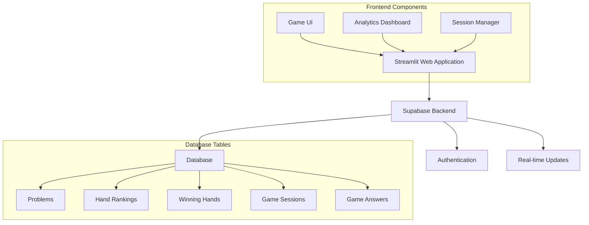
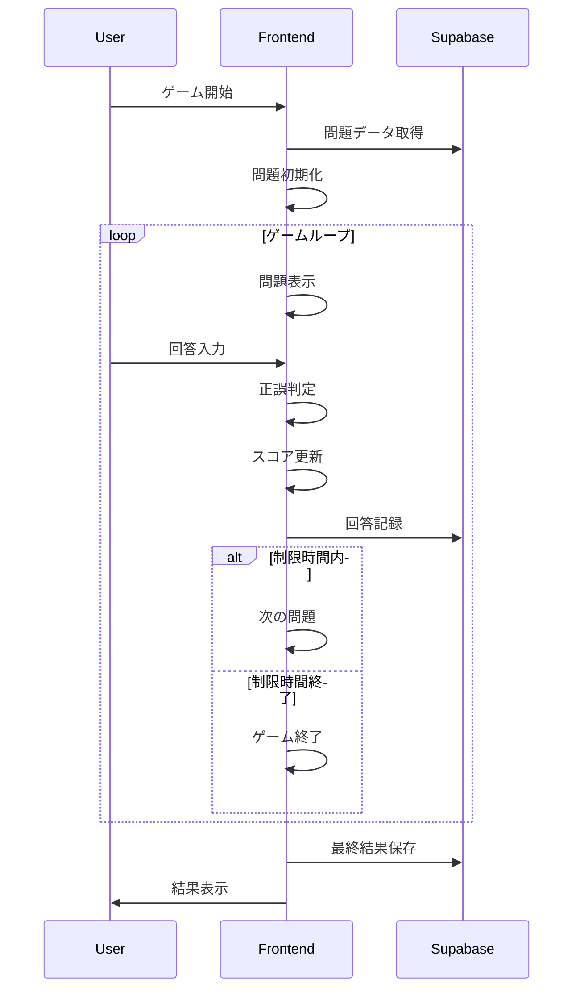

# テキサスホールデム・ショーダウンマスター MVPの詳細設計

## 1. システムアーキテクチャ
### 概要
シンプルな2層アーキテクチャを採用し、フロントエンドのStreamlitアプリケーションとバックエンドのSupabaseデータベースで構成されます。この構成により、高い保守性とスケーラビリティを実現します。

### アーキテクチャ図


## 2. データベース設計
### テーブル構造
各テーブルは特定の責務を持ち、相互に関連付けられています：

#### problems テーブル
```sql
CREATE TABLE IF NOT EXISTS problems (
    id              int PRIMARY KEY,
    community_cards VARCHAR(15) NOT NULL,
    player_hands    VARCHAR(11) NOT NULL,
    correct_answer  int NOT NULL
);
```

#### hand_rankings テーブル
```sql
CREATE TABLE IF NOT EXISTS hand_rankings (
    id INTEGER PRIMARY KEY,
    name_en VARCHAR(50) NOT NULL,
    name_jp VARCHAR(50) NOT NULL,
    rank_strength INTEGER NOT NULL
);
```

#### winning_hands テーブル
```sql
CREATE TABLE IF NOT EXISTS winning_hands (
    problem_id INTEGER PRIMARY KEY REFERENCES problems(id),
    hand_ranking_id INTEGER NOT NULL REFERENCES hand_rankings(id),
    top_five_cards VARCHAR(15) NOT NULL,
    description VARCHAR(100) NOT NULL
);
```

#### game_sessions テーブル
```sql
CREATE TABLE IF NOT EXISTS game_sessions (
    id uuid default uuid_generate_v4() primary key,
    score integer not null,
    problems_solved integer not null,
    game_duration integer not null,
    played_at timestamp with time zone not null
);
```

#### game_answers テーブル
```sql
CREATE TABLE IF NOT EXISTS game_answers (
    id uuid default uuid_generate_v4() primary key,
    game_session_id uuid references game_sessions(id),
    community_cards text not null,
    player_hands text not null,
    correct_answer integer not null,
    player_answer integer not null,
    point integer not null,
    elapsed_time float not null,
    answered_at timestamp with time zone not null
);
```

## 3. アプリケーション設計
### データモデル
```python
@dataclass
class Card:
    suit: str
    rank: str

@dataclass
class Problem:
    id: int
    community_cards: List[Card]
    player_hands: List[Tuple[Card, Card]]
    correct_answer: int

@dataclass
class Answer:
    problem: Problem
    player_answer: int
    point: int
    elapsed_time: int
```

### 状態管理
Streamlitのセッション状態で管理する主要な変数：
```python
st.session_state.game_state: str  # "start", "playing", "end"
st.session_state.score: int
st.session_state.problems_solved: int
st.session_state.game_session_start_time: float
st.session_state.current_problem_start_time: float
st.session_state.answer_list: List[Answer]
```

## 4. 画面設計
### メイン画面レイアウト
```
==================================
残り時間: 57秒    スコア: 30点

コミュニティカード:
[♠A] [♥K] [♦7] [♣3] [♠9]

プレイヤーの手札:
プレイヤー1: [♥A] [♠K]
プレイヤー2: [♦A] [♣K]

[プレイヤー1を選択] [プレイヤー2を選択] [チョップ]
==================================
```

### 分析ダッシュボードレイアウト
```
==================================
データ分析ダッシュボード

[テーブル選択ドロップダウン]
[グラフタイプ選択]
[分析軸選択]

[データビジュアライゼーション]

[フィルター設定]
[データテーブル表示]
==================================
```

## 5. 機能フロー
### ゲームフロー


## 6. エラーハンドリング
### データベースエラー
```python
try:
    # データベース操作
    result = execute_query(...)
except Exception as e:
    st.error(f"エラーが発生しました: {str(e)}")
    # エラーログ記録
    log_error(e)
```

## 7. パフォーマンス最適化
### データベースアクセス
- クエリの最適化
- インデックスの適切な設定
- キャッシュの活用

### フロントエンド
- 状態管理の最適化
- 必要最小限のリアルタイム更新
- 効率的なレンダリング

## 8. セキュリティ設計
### データ保護
- 入力値のバリデーション
- SQLインジェクション対策
- XSS対策

### エラー情報
- 詳細なエラー情報の非表示
- エラーログの安全な保存
- アクセス制御の実装

## 9. 監視と分析
### パフォーマンスモニタリング
- レスポンスタイムの計測
- エラー率の監視
- リソース使用率の追跡

### ユーザー行動分析
- 問題ごとの正答率
- 平均解答時間
- セッション継続時間
