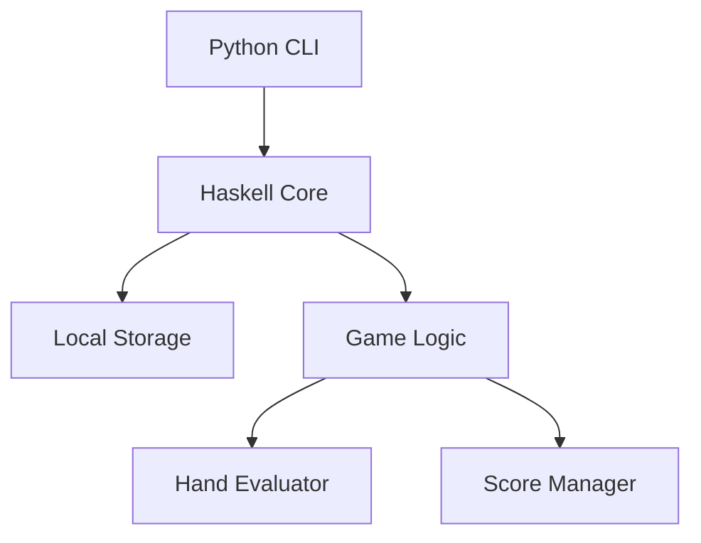
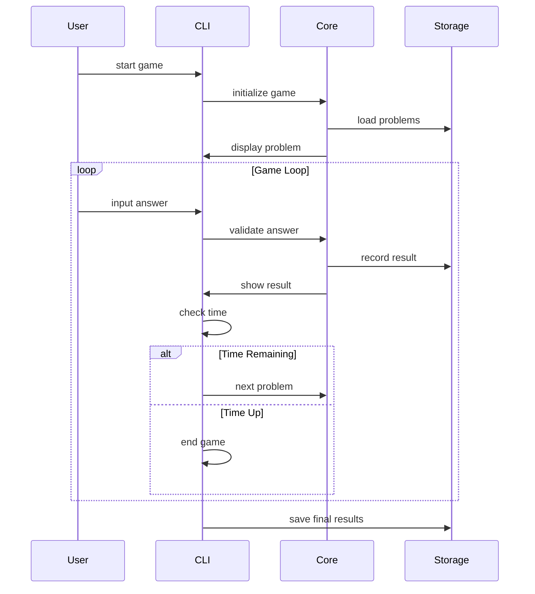

# テキサスホールデム・ショーダウンマスター MVPの詳細設計

## システムアーキテクチャ
### シンプルな2層構造
- フロントエンド：Python CLI（Google Colaboratory）
- バックエンド：Haskellロジック（組み込み）

### アーキテクチャ図


## データベース設計
### ローカルストレージ（CSV）
```csv
# games.csv
game_id,timestamp,duration,score,problems_solved,correct_answers

# problems.csv
problem_id,community_cards,player_hands,correct_answer,difficulty

# analytics.csv
session_id,problem_id,response_time,is_correct,timestamp
```

### データ構造
```haskell
-- Haskellコア
data GameState = GameState {
    currentScore :: Int,
    timeRemaining :: Int,
    problemsSolved :: Int,
    currentProblem :: Problem
}

data Problem = Problem {
    communityCards :: [Card],
    playerHands :: [[Card]],
    correctAnswer :: Int
}
```

## UI/UX設計
### CLI画面レイアウト
```
=== テキサスホールデム・ショーダウンマスター ===
残り時間: 57秒  現在のスコア: 30点

コミュニティカード:
[♠A] [♥K] [♦7] [♣3] [♠9]

プレイヤー1: [♥A] [♠K]
プレイヤー2: [♦A] [♣K]
プレイヤー3: [♣A] [♦K]

勝者を入力してください（1-3、または0でスプリットポット）:
```

## 機能詳細設計
### ゲームフロー


### スコアリングシステム

## 技術詳細
### 開発環境と言語
- Python 3.8+
- Haskell GHC 9.4.7
- Google Colaboratory
- Git/GitHub
- Stack (Haskell)

### クラス構造

### データ永続化

## セキュリティ設計
### データ保護
- ローカルファイルの暗号化なし（MVP段階）
- 入力値のバリデーション
- エラーメッセージの制限（詳細なエラー情報は非表示）

### エラーハンドリング

## テスト計画
### 単体テスト

### 統合テスト

## デプロイと運用
### 環境構築
```bash
# Haskell環境セットアップ
stack new rainbow
mv rainbow haskell
cd haskell
stack run
```

### モニタリング
