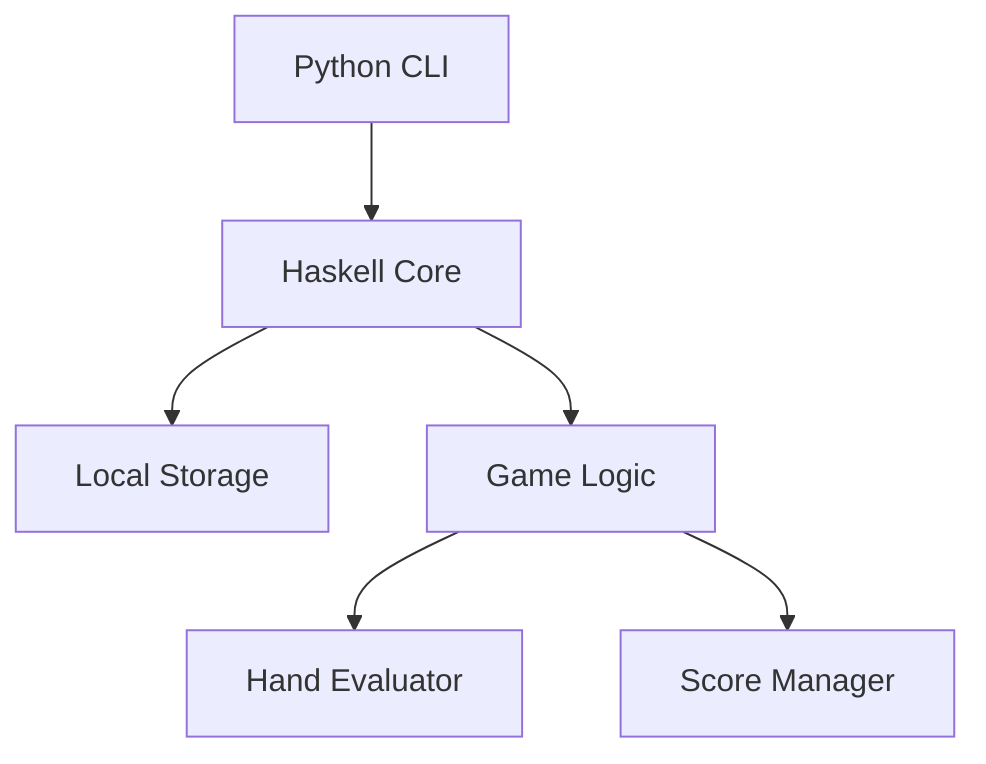
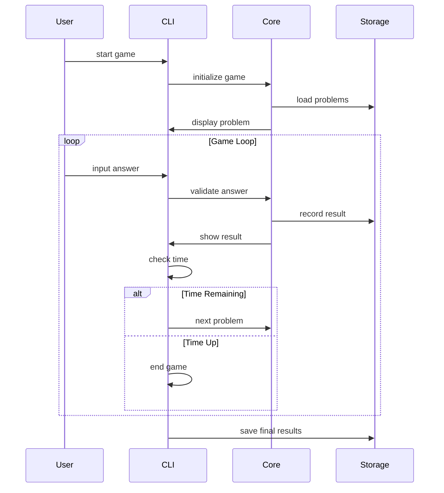

# テキサスホールデム・ショーダウンマスター MVPの詳細設計

## システムアーキテクチャ
### シンプルな2層構造
- フロントエンド：Python CLI（Google Colaboratory）
- バックエンド：Haskellロジック（組み込み）

### アーキテクチャ図


## データベース設計
### ローカルストレージ（CSV）
```csv
# games.csv
game_id,timestamp,duration,score,problems_solved,correct_answers

# problems.csv
problem_id,community_cards,player_hands,correct_answer,difficulty

# analytics.csv
session_id,problem_id,response_time,is_correct,timestamp
```

### データ構造
```haskell
-- Haskellコア
data GameState = GameState {
    currentScore :: Int,
    timeRemaining :: Int,
    problemsSolved :: Int,
    currentProblem :: Problem
}

data Problem = Problem {
    communityCards :: [Card],
    playerHands :: [[Card]],
    correctAnswer :: Int
}
```

## UI/UX設計
### CLI画面レイアウト
```
=== テキサスホールデム・ショーダウンマスター ===
残り時間: 57秒  現在のスコア: 30点

コミュニティカード:
[♠A] [♥K] [♦7] [♣3] [♠9]

プレイヤー1: [♥A] [♠K]
プレイヤー2: [♦A] [♣K]
プレイヤー3: [♣A] [♦K]

勝者を入力してください（1-3、または0でスプリットポット）:
```

## 機能詳細設計
### ゲームフロー


### スコアリングシステム
```python
def calculate_score(correct: bool, time_taken: float, streak: int = 0) -> int:
    base_score = 10 if correct else -5
    time_bonus = max(0, 5 - int(time_taken)) if correct else 0
    streak_bonus = (streak // 5) * 2 if correct and streak > 0 else 0
    
    return base_score + time_bonus + streak_bonus
```

## 技術詳細
### 開発環境と言語
- Python 3.8+
- Haskell GHC 9.4.7
- Google Colaboratory
- Git/GitHub
- Stack (Haskell)

### クラス構造
```python
class Game:
    def __init__(self):
        self.score = 0
        self.time_remaining = 60
        self.problems = []
        self.current_streak = 0
        self.logger = GameLogger()
        
    def start(self):
        self.load_problems()
        self.timer = Timer(60)
        self.main_loop()
        
    def main_loop(self):
        while self.time_remaining > 0:
            self.display_current_problem()
            answer = self.get_player_input()
            if self.evaluate_answer(answer):
                self.update_score(True)
                self.current_streak += 1
            else:
                self.update_score(False)
                self.current_streak = 0

class Problem:
    def __init__(self, community: List[Card], hands: List[List[Card]], answer: int):
        self.community_cards = community
        self.player_hands = hands
        self.correct_answer = answer
        
    def display(self):
        self.display_community()
        self.display_hands()
        
    def check_answer(self, player_answer: int) -> bool:
        return player_answer == self.correct_answer
```

### データ永続化
```python
class Storage:
    def __init__(self, base_path: str = "./data"):
        self.base_path = base_path
        self.ensure_directories()
    
    def ensure_directories(self):
        os.makedirs(self.base_path, exist_ok=True)
        os.makedirs(f"{self.base_path}/backup", exist_ok=True)
    
    def save_game_result(self, game_data: dict):
        with open(f"{self.base_path}/games.csv", "a") as f:
            writer = csv.DictWriter(f, fieldnames=GAME_FIELDS)
            writer.writerow(game_data)
    
    def backup_data(self):
        timestamp = datetime.now().strftime("%Y%m%d_%H%M%S")
        for file in ["games.csv", "analytics.csv"]:
            shutil.copy(
                f"{self.base_path}/{file}",
                f"{self.base_path}/backup/{timestamp}_{file}"
            )
```

## セキュリティ設計
### データ保護
- ローカルファイルの暗号化なし（MVP段階）
- 入力値のバリデーション
- エラーメッセージの制限（詳細なエラー情報は非表示）

### エラーハンドリング
```python
class GameError(Exception):
    """ゲーム固有のエラー"""
    pass

def safe_input(prompt: str) -> str:
    try:
        user_input = input(prompt).strip().lower()
        if user_input == 'quit':
            raise GameError("Game terminated by user")
        if not user_input.isdigit() or not 0 <= int(user_input) <= 3:
            raise ValueError("Invalid input")
        return user_input
    except EOFError:
        raise GameError("Input stream closed")
    except KeyboardInterrupt:
        raise GameError("Game interrupted by user")
    except ValueError as e:
        print("Please enter a number between 0 and 3")
        return safe_input(prompt)
```

## テスト計画
### 単体テスト
```python
class TestGame(unittest.TestCase):
    def setUp(self):
        self.game = Game()
        self.test_cards = [
            Card('A', 'Spades'),
            Card('K', 'Spades'),
            Card('Q', 'Spades')
        ]
    
    def test_hand_evaluation(self):
        result = self.game.evaluate_hand(self.test_cards)
        self.assertEqual(result, ExpectedHand.FLUSH)
    
    def test_scoring(self):
        score = calculate_score(correct=True, time_taken=2.5, streak=3)
        self.assertEqual(score, 10)  # Base score only for MVP

class TestProblem(unittest.TestCase):
    def test_answer_validation(self):
        problem = Problem(
            community=[Card('A', 'Spades')],
            hands=[[Card('K', 'Hearts')], [Card('Q', 'Diamonds')]],
            answer=1
        )
        self.assertTrue(problem.check_answer(1))
        self.assertFalse(problem.check_answer(2))
```

### 統合テスト
```python
def test_complete_game_flow():
    game = Game()
    game.start()
    
    # 通常の回答フロー
    game.process_answer(1)
    assert game.score >= 0
    assert game.time_remaining <= 60
    
    # エラー処理
    with pytest.raises(GameError):
        game.process_answer(4)
    
    # タイムアウト
    game.time_remaining = 0
    assert game.is_game_over()
```

## デプロイと運用
### 環境構築
```bash
# ローカル環境セットアップ
python -m venv venv
source venv/bin/activate  # Windows: venv\Scripts\activate
pip install -r requirements.txt
stack build

# Colaboratory環境セットアップ
!pip install -r requirements.txt
!git clone https://github.com/user/texas-holdem-trainer.git
!cd texas-holdem-trainer && python setup.py install
```

### モニタリング
```python
class Logger:
    def __init__(self, log_path: str = "logs"):
        self.log_path = log_path
        os.makedirs(log_path, exist_ok=True)
        
    def log_event(self, event_type: str, data: dict):
        timestamp = datetime.now().isoformat()
        log_entry = {
            "timestamp": timestamp,
            "type": event_type,
            "data": data
        }
        
        log_file = f"{self.log_path}/{datetime.now().strftime('%Y%m%d')}.log"
        with open(log_file, "a") as f:
            json.dump(log_entry, f)
            f.write("\n")
```
